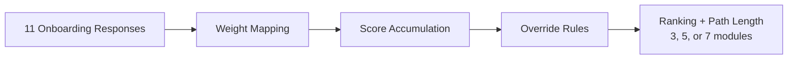
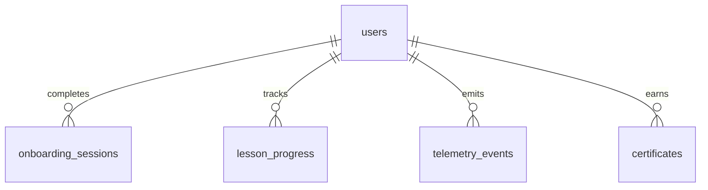

# AI Literacy Platform

**Double Degree Capstone Project — BBA & BDBA**
IE University | Ramon Zubiaga Suarez | 2026

---

An AI-literacy microlearning platform for non-technical professionals. Users complete an 11-question onboarding assessment, receive a deterministic personalized learning path, and progress through structured article-based lessons with inline activities, XP tracking, and streak mechanics.

### Tech Stack


| Layer      | Technology                                    |
| ---------- | --------------------------------------------- |
| Framework  | Next.js 16 (App Router), React 19, TypeScript |
| Styling    | Tailwind CSS, custom design tokens            |
| Backend    | Supabase (PostgreSQL + Auth + RLS)            |
| Payments   | Stripe                                        |
| Testing    | Vitest (unit), Playwright (E2E)               |
| Deployment | Vercel                                        |


All curriculum content (10 modules, 214 lessons) is authored as TypeScript data files and served statically — no external CMS dependency.

---

## Quick Reviewer Test Flow

Use the live deployment linked in the repository or the configured production domain.

1. Open the landing page.
2. Start the onboarding assessment.
3. Complete all 11 questions and review the personalized recommendation.
4. Create an account. Any valid email format is accepted because email verification is not required in this capstone deployment.
5. After sign-up, confirm you are redirected into the platform and that your recommended path is visible.
6. Open one recommended module, complete one lesson, and finish the associated activity or quiz.

This verifies the full thesis-critical learner journey: landing page → onboarding → account creation → personalized platform access → lesson completion.

---

## Project Structure

```
├── src/
│   ├── app/                    # Next.js App Router — all routes
│   ├── components/             # React components by domain
│   ├── lib/                    # Core logic and integrations
│   ├── data/                   # Content, config, and design tokens
│   └── types/                  # Shared TypeScript contracts
├── supabase/                   # Database schema and project config
├── docs/                       # Architecture docs and pilot-study data
├── scripts/                    # Validation and maintenance scripts
├── e2e/                        # Playwright end-to-end tests
└── public/                     # Static assets (images, fonts)
```

---

## Routes (`src/app/`)

The application uses Next.js route groups to separate concerns:


| Route group   | Path                                                       | What it handles                                                                                          |
| ------------- | ---------------------------------------------------------- | -------------------------------------------------------------------------------------------------------- |
| `(marketing)` | `/`                                                        | Landing page, public-facing content                                                                      |
| `(auth)`      | `/login`, `/signup`, `/forgot-password`, `/reset-password` | Authentication flows                                                                                     |
| `onboarding`  | `/onboarding`, `/onboarding/results`                       | 11-question onboarding assessment and personalized recommendation output                                 |
| `platform`    | `/platform/**`                                             | Authenticated learner experience — dashboard, modules, lessons, progress, profile, library, certificates |
| `checkout`    | `/checkout/**`                                             | Stripe-powered checkout, success page, welcome coupon flow                                               |
| `api`         | `/api/**`                                                  | Server-side endpoints for auth, analytics, checkout, onboarding, platform actions, and Stripe webhooks   |


---

## Components (`src/components/`)

Components are organized by domain rather than by type:


| Folder        | Scope                                                                                                                                                         |
| ------------- | ------------------------------------------------------------------------------------------------------------------------------------------------------------- |
| `ui/`         | Generic primitives — buttons, cards, badges, modals, progress bars                                                                                            |
| `layout/`     | Structural components — top nav, platform sidebar, bottom nav                                                                                                 |
| `landing/`    | Marketing and landing page sections                                                                                                                           |
| `auth/`       | Login/signup form components                                                                                                                                  |
| `onboarding/` | Onboarding quiz shell and flow components                                                                                                                     |
| `platform/`   | All authenticated platform UI, subdivided into `home/`, `modules/`, `lessons/`, `learning/`, `checkout/`, `certificate/`, `feedback/`, `profile/`, `onboarding-ui/` |
| `checkout/`   | Checkout flow UI (anonymous auth, success content)                                                                                                            |
| `shared/`     | Cross-cutting components used across marketing and platform (brand marks, shared elements)                                                                    |
| `providers/`  | React context providers (theme, etc.)                                                                                                                         |


---

## Core Logic (`src/lib/`)


| Folder             | Responsibility                                                                                 |
| ------------------ | ---------------------------------------------------------------------------------------------- |
| `personalization/` | The recommendation algorithm, onboarding context, and user metadata sync                       |
| `supabase/`        | Server and browser Supabase client factories                                                   |
| `auth/`            | Access control helpers and auth boundary logic                                                 |
| `stripe/`          | Stripe client, configuration (multi-currency pricing), and checkout utilities                  |
| `hooks/`           | Shared React hooks — `useUser`, `useProgress`, `useHomeJourneySection` |
| `telemetry.ts`     | First-party event capture to `telemetry_events` table                                          |
| `analytics/`       | Page view tracking, consent, and server-side tracking utilities                                |
| `security/`        | Redirect validation and input sanitization                                                     |
| `utils/`           | General utilities — module helpers, lesson images, retry logic, formatting                     |
| `routes/`          | Centralized route constants                                                                    |


---

## Curriculum Content (`src/data/content/`)

All course content is defined in TypeScript. There are no external CMS dependencies.

### 10 Modules, 214 Lessons


| #   | Module                  | Lessons | Focus                                            |
| --- | ----------------------- | ------- | ------------------------------------------------ |
| 01  | AI Foundations          | 13      | Understanding AI capabilities and limitations    |
| 02  | Productivity Basics     | 9       | Applying AI to daily professional tasks          |
| 03  | Prompt Engineering      | 10      | Constructing effective AI inputs/outputs         |
| 04  | Content Creation        | 10      | Writing, reports, presentations with AI          |
| 05  | ChatGPT                 | 30      | Entry-level multi-purpose AI tool                |
| 06  | Claude                  | 30      | Research, writing, and text analysis             |
| 07  | Gemini                  | 27      | Google Workspace integration                     |
| 08  | Midjourney              | 27      | Visual content for non-designers                 |
| 09  | Workflows & Automation  | 30      | Multi-tool chains and process automation         |
| 10  | 28-Day AI Challenge     | 28      | Daily habit formation and sustained practice     |


Each module is organized into chapters, and each chapter contains lesson files. A lesson includes article sections, inline checkpoints, tool references, and image metadata.

```
src/data/content/modules/
├── 01-skills-foundations/
│   ├── chapter1-foundation/
│   │   ├── index.ts
│   │   ├── lesson-1-1.ts
│   │   ├── lesson-1-2.ts
│   │   └── ...
│   ├── chapter2-core-capabilities/
│   └── ...
├── 02-skills-productivity/
└── ...
```

---

## Onboarding and Personalization

### Assessment

The onboarding assessment captures 11 single-choice questions across five dimensions (see thesis Appendix A.5):

| Dimension | Questions | What it captures |
| --- | --- | --- |
| Professional Context | Q1–Q2 | Work situation and day-to-day domain |
| Current AI Experience | Q3–Q5 | AI tool usage, frequency, and perceived output quality |
| Motivation and Pain Points | Q6–Q7 | Primary reason for learning AI and biggest current frustration |
| Confidence and Readiness | Q8–Q9 | Technology confidence and learning readiness |
| Time and Goals | Q10–Q11 | Daily time availability and desired outcome |

The assessment is completed before account creation — users receive their personalized recommendation before being asked to sign up.

### Recommendation Algorithm

The personalization engine (`src/lib/personalization/algorithm.ts`) is deterministic and runs entirely on the server. It processes all 11 responses through four stages:



**Stage 1 — Weight mapping.** Each response is mapped to its corresponding module weights via the `RESPONSE_WEIGHTS` scoring table.

**Stage 2 — Score accumulation.** Weights from all 11 responses are summed per module to produce baseline scores.

**Stage 3 — Override rules.** Four context-sensitive rules modify the ranked scores (thesis §4.2.3). The algorithm audit confirmed each rule fires correctly across all 7,372,800 input combinations:


| Rule | Profiles fired | Trigger | Effect |
| --- | --- | --- | --- |
| Beginner / novice-or-no-tools boost | 43.8% | No AI experience or no tools used | +10 AI Foundations, +5 Productivity Basics |
| Intermediate AI adjustment | 50.0% | Intermediate or regular AI use | +6 Prompt Engineering, −4 AI Foundations |
| Independent-profession boost | 50.0% | Freelancer or business owner | +3 Content Creation, +3 Productivity Basics |
| Time-for-challenge routing | 50.0% | 20+ minutes available daily | +4 to 28-Day Challenge |


**Stage 4 — Ranking and path length.** Modules are ranked by adjusted score. Path length is derived from daily time availability (Q10): 5 min → 3 modules, 10–15 min → 5, 20+ min → 7. The top-N modules become the recommended path.

The algorithm also derives:

- **Persona** from motivation response (business_leverager, threatened_performer, curious_explorer)
- **Customer profile** from work context (employee or independent)
- **AI experience level** from self-assessment (none, basic, intermediate, regular)

---

## Data Model

Five public tables in Supabase, defined in `supabase/migrations/20260410000000_schema.sql`:




| Table                 | Purpose                    | Key columns                                                                                            |
| --------------------- | -------------------------- | ------------------------------------------------------------------------------------------------------ |
| `users`               | Profile and progress state | `total_xp`, `current_streak`, `longest_streak`, `has_access`, `metadata`                               |
| `onboarding_sessions` | Assessment results         | `responses` (JSONB), `persona`, `customer_profile`, `ai_experience`, `recommended_path`, `path_length`, `session_snapshot` |
| `lesson_progress`     | Per-lesson tracking        | `lesson_id`, `module_id`, `status`, `xp_earned`, `started_at`, `completed_at`                          |
| `telemetry_events`    | Behavioral event log       | `event_type`, `payload` (JSONB), `created_at`                                                          |
| `certificates`        | Module completion          | `id`, `module_id`, `issued_at`                                                                         |


All tables enforce Row Level Security — users can only access their own rows. A database trigger automatically creates a `users` row when a new auth account is created.

---

## Telemetry

The platform stores first-party telemetry in `telemetry_events` to support onboarding analysis, recommendation feedback, lesson engagement, checkpoint activity, XP and streak updates, challenge progress, and route-level page views. Event capture is implemented in `src/lib/telemetry.ts` and written to Supabase with user-scoped access controls.


---

## Authentication and Access

- **Authentication:** Supabase Auth (email + password).
- **Platform access:** gated by `has_access` flag on the `users` row, set after checkout or manual grant.
- **Row Level Security:** every public table is RLS-enabled; policies use `auth.uid()` as the ownership boundary.

---

## Checkout and Payments

The platform uses Stripe to grant paid access to the learner experience. Checkout configuration lives in `src/lib/stripe/config.ts`, and access activation is handled through the application checkout and webhook flows.

---

## Pilot-Study Data

`docs/pilot-study/` contains documentation and data from the 12-participant pilot study (N=12, March 2026).

- `participant-outcomes.md` — per-participant outcome matrix
- `hypothesis-results.md` — hypothesis evaluation summary
- `personalization-outputs.md` — algorithm classifications for all participants
- `data/*.json` — database records exported from Supabase

---

## Scripts


| Script                                             | Command                   | Purpose                                                                               |
| -------------------------------------------------- | ------------------------- | ------------------------------------------------------------------------------------- |
| `scripts/algorithm_audit.ts`                       | `npm run algorithm:audit` | Exhaustive audit of all 7.3M input combinations through the personalization algorithm |
| `scripts/pilot-study/generate_chapter4_figures.py` | —                         | Generates thesis Chapter 4 figures (Python/matplotlib)                                |


---

## Documentation

Extended technical documentation is available in `docs/`:


| Document                | Path                                                         |
| ----------------------- | ------------------------------------------------------------ |
| Architecture overview   | `docs/architecture/system-overview.md`                       |
| Personalization design  | `docs/architecture/personalization.md`                       |
| Data and evidence model | `docs/architecture/data-and-evidence.md`                     |
| Content model           | `docs/architecture/content-model.md`                         |
| Platform flow           | `docs/platform/README.md`                                    |
| Curriculum structure    | `docs/courses/README.md`                                     |
| App settings and auth   | `docs/app-settings/README.md`                                |
| Thesis figures          | `docs/figures/` (Chapter 4 charts generated from pilot data) |


---

## Verification

- `npm run lint` — ESLint
- `npm run test` — unit tests (Vitest)
- `npm run test:e2e:functional` — Playwright end-to-end (10 core flows)
- `npm run algorithm:audit` — exhaustive personalization algorithm audit (7.3M input combinations)

## Local Development

```bash
npm install
npm run dev
```

Runs at `http://localhost:3000`. Environment configuration is documented in `.env.example`.
